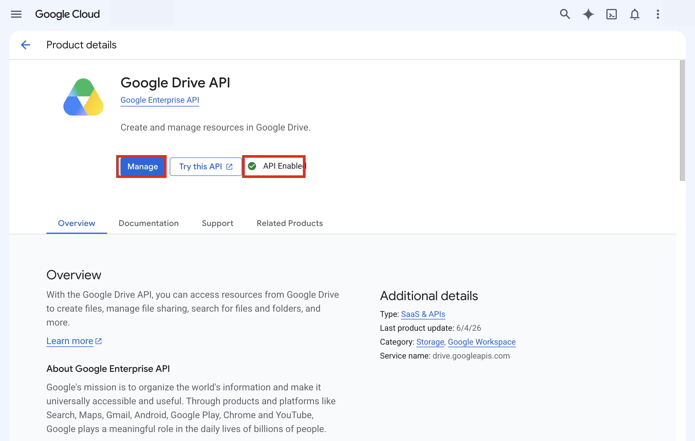
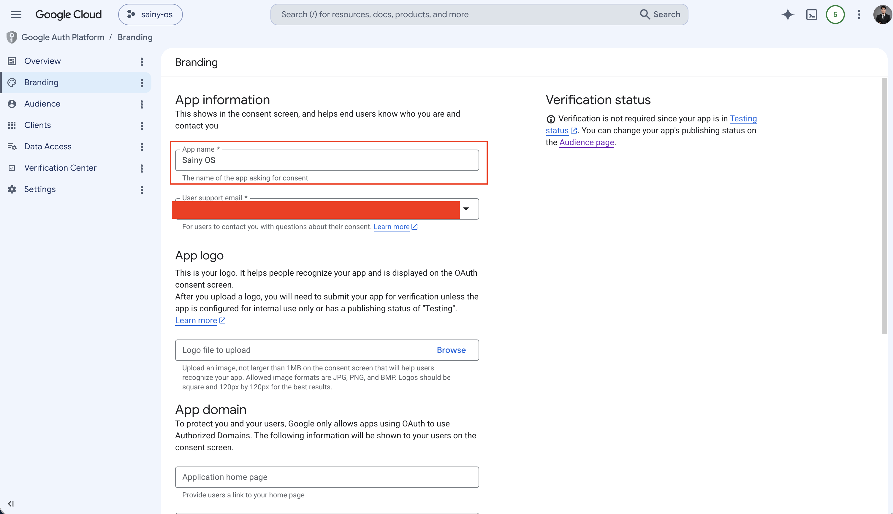
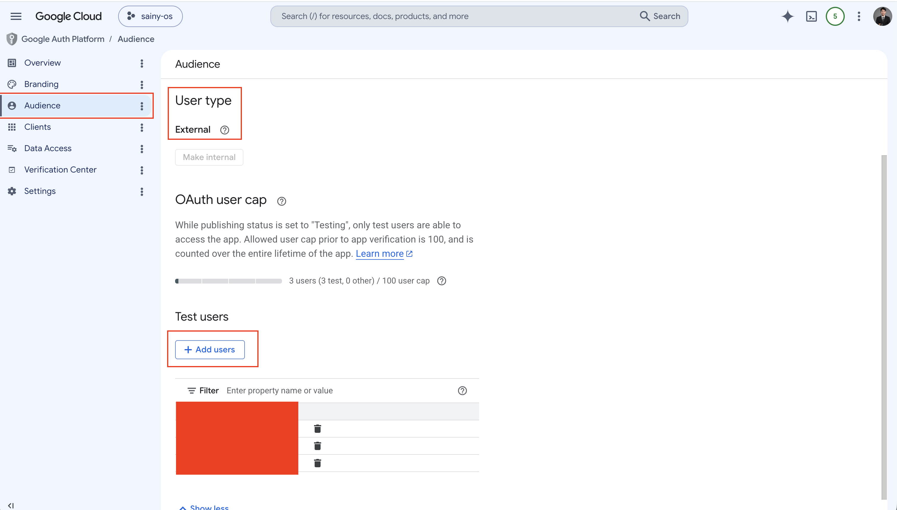
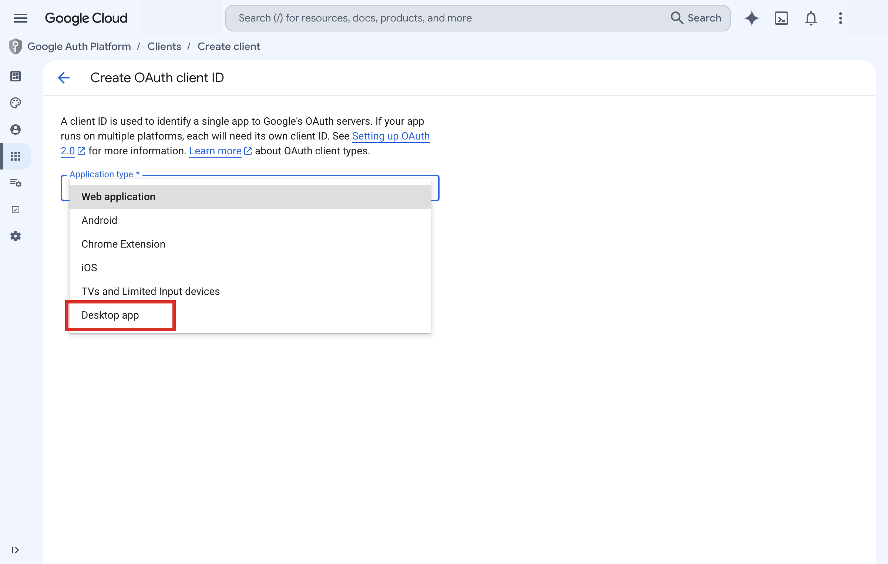
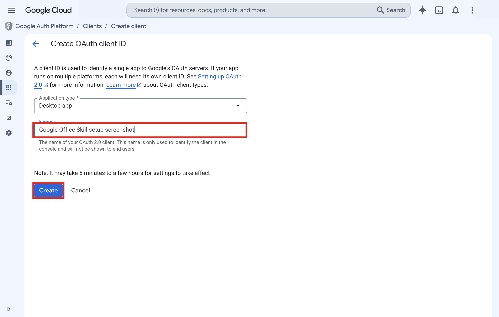

# google-office — Setup Guide

How to create and configure a Google OAuth 2.0 client so the skill can read and write Drive, Docs, and Sheets on behalf of your Google account.

---

## Prerequisites

- A Google account with access to [Google Cloud Console](https://console.cloud.google.com)
- A GCP project (create one at **console.cloud.google.com → Select project → New project** if you don't have one)

---

## Step 1 — Enable the required APIs

Go to [console.cloud.google.com](https://console.cloud.google.com), select your project, then navigate to **APIs & Services → Library**.


Search for and enable each of the following APIs. For each: click the API name, then click **Enable**. If the **Manage** button is already shown alongside an **API Enabled** badge, it's already on — skip to the next.

| API | Purpose |
|-----|---------|
| Google Drive API | List, upload, download files |
| Google Docs API | Read and write Docs |
| Google Sheets API | Read and write Sheets |



---

## Step 2 — Configure the OAuth consent screen (first time only)

If this is a brand-new project with no OAuth credentials, GCP requires a consent screen before you can create a client.

Go to **APIs & Services → OAuth consent screen** (or **Google Auth Platform → Branding** in the newer console layout).

> If the consent screen is already configured (existing project), skip this step.

### 2a — User type

Choose **External** (personal Google accounts and any Google account) or **Internal** (Google Workspace orgs only). For personal use, pick **External**.

### 2b — App information

Fill in the required fields:

| Field | Notes |
|-------|-------|
| **App name** | Shown on the consent screen, e.g. `My Office Agent` |
| **User support email** | Your email address |
| **Developer contact information** | Your email address (required — easy to miss, at the bottom of the form) |

All other fields (logo, homepage, privacy policy, terms of service) are optional — leave them blank.



Click **Save and Continue**.

### 2c — Test users

Because the app is in **Testing** mode, only explicitly listed Google accounts can complete the OAuth flow.

Click **Add users** and enter your Google account email. Click **Save and Continue**.



---

## Step 3 — Create an OAuth 2.0 Client ID

Go to **APIs & Services → Credentials**. Click **+ Create credentials**.


Select **OAuth client ID** from the dropdown.


---

## Step 4 — Select Desktop app

On the **Create OAuth client ID** form, open the **Application type** dropdown and choose **Desktop app**.



Enter a descriptive **Name** (shown only in the console, not to end users) and click **Create**.



---

## Step 5 — Copy your credentials

A dialog appears showing your **Client ID** and **Client secret**.


> **Copy both values before closing this dialog.** The client secret cannot be retrieved again — if lost you must create a new secret (or a new client).
>
> Alternatively click **Download JSON** to save a file containing both values.

- **Client ID** — long string ending in `.apps.googleusercontent.com`
- **Client secret** — short string starting with `GOCSPX-`

---

## Step 6 — Fill in `.env`

Copy `env.example` to `.env` inside the skill directory:

**Claude Code**
```sh
cp .claude/skills/google-office/env.example .claude/skills/google-office/.env
```

**Codex**
```sh
cp .agents/skills/google-office/env.example .agents/skills/google-office/.env
```

Edit `.env` and fill in the values you copied:

```dotenv
GOOGLE_CLIENT_ID=<paste Client ID here>
GOOGLE_CLIENT_SECRET=<paste Client secret here>
GOOGLE_REDIRECT_URI=http://localhost:3457/office/callback
GOOGLE_SCOPES=https://www.googleapis.com/auth/drive https://www.googleapis.com/auth/documents https://www.googleapis.com/auth/spreadsheets https://www.googleapis.com/auth/userinfo.email
```

> **Desktop app** clients automatically accept any `localhost` loopback redirect URI — you do not need to register `http://localhost:3457/office/callback` anywhere in the GCP console.

> **Reusing credentials:** If you already have a Desktop-type OAuth client (e.g., from the `read-gmail` skill), you can paste the same Client ID and Secret here — no extra console changes needed.

---

## Step 7 — Log in

From the repo root:

**Claude Code**
```sh
bun .claude/skills/google-office/scripts/office.ts login
```

**Codex**
```sh
bun .agents/skills/google-office/scripts/office.ts login
```

A browser window opens the Google OAuth consent screen. Sign in and approve the requested permissions. The token is saved to `.claude/skills/google-office/.data/accounts/<email>.json` (Claude Code) or `.agents/skills/google-office/.data/accounts/<email>.json` (Codex).

Verify:

**Claude Code**
```sh
bun .claude/skills/google-office/scripts/office.ts status
```

**Codex**
```sh
bun .agents/skills/google-office/scripts/office.ts status
```

---

## Troubleshooting

| Symptom | Fix |
|---------|-----|
| `redirect_uri_mismatch` | You likely chose **Web application** instead of **Desktop app**. Create a new Desktop-type client. |
| "Unverified app" / `access_denied` loop | Add your email under **Google Auth Platform → Audience → Test users**. |
| `invalid_client` | Client ID or secret pasted with extra whitespace. Re-check `.env`. |
| Lost client secret | Go to **Google Auth Platform → Clients**, open the client, scroll to **Client secrets**, and add a new one. Or delete the client and repeat Steps 3–5. |
