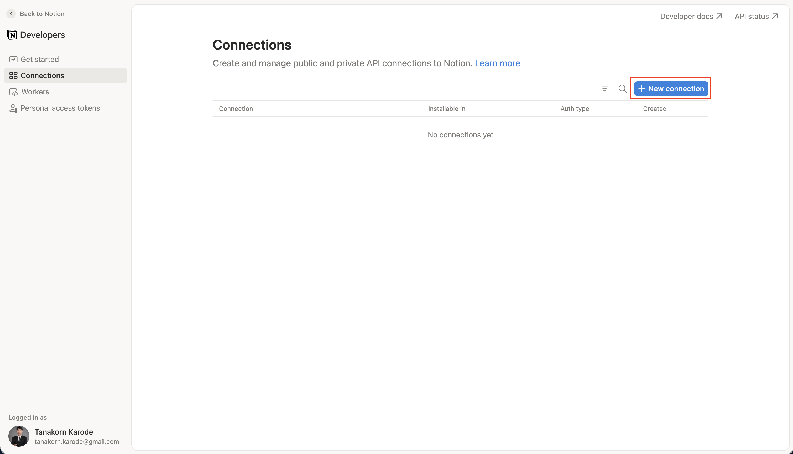
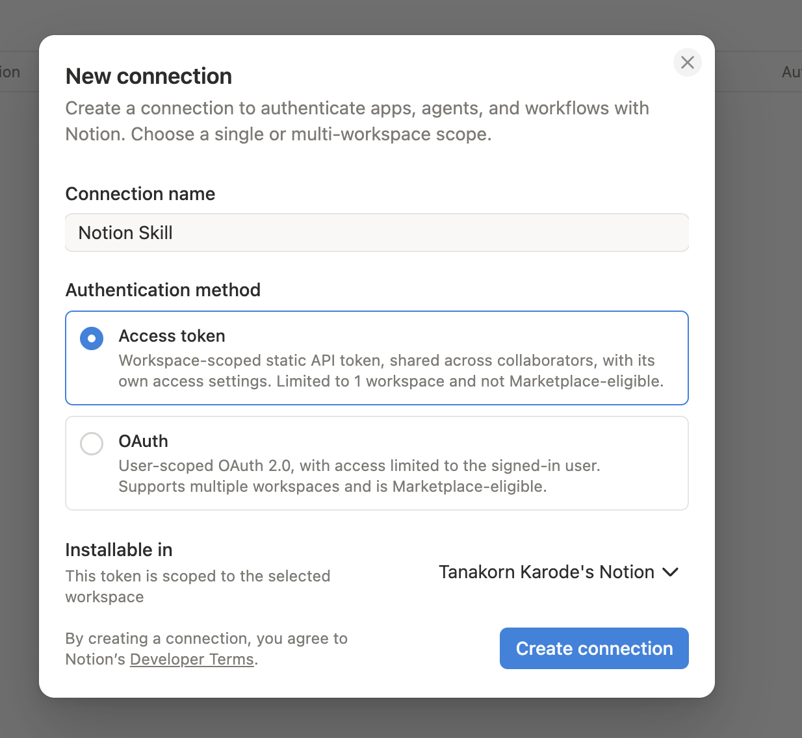
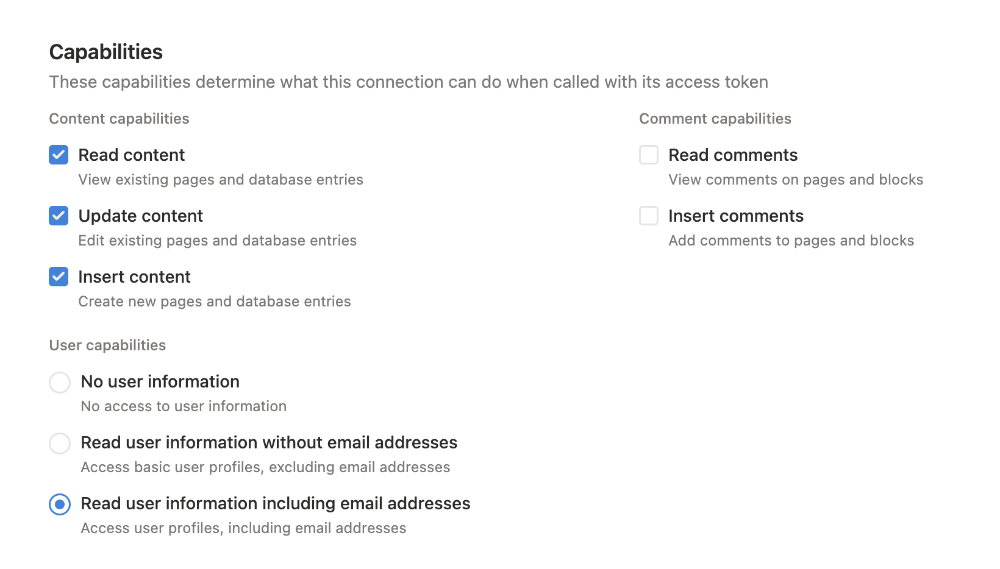
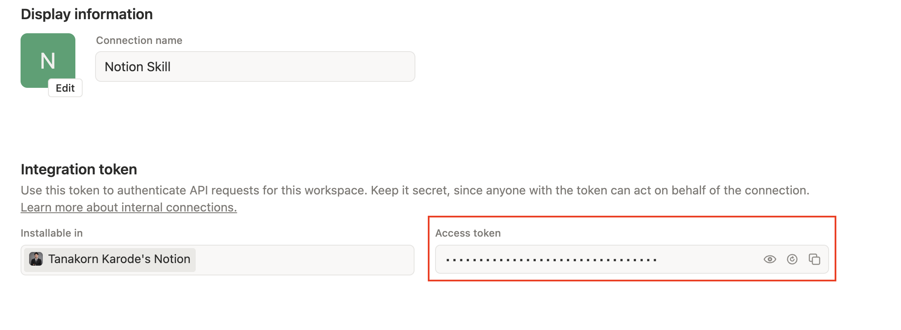
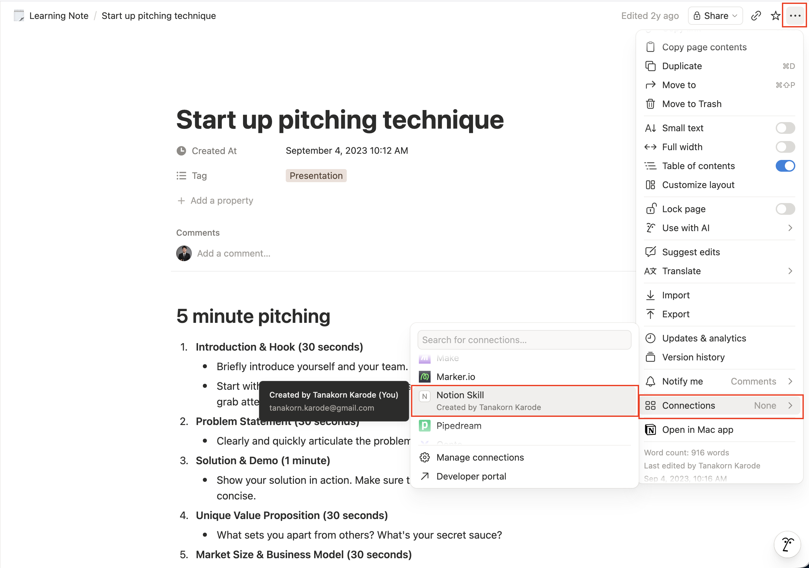
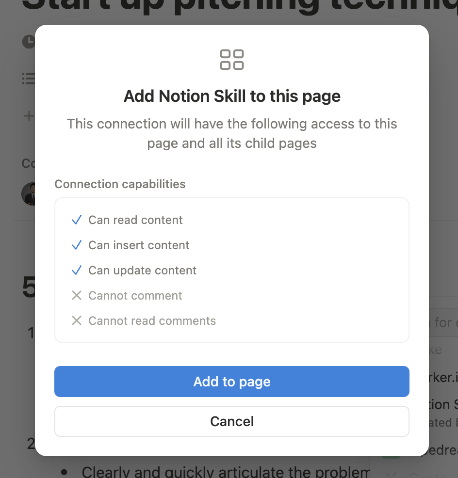
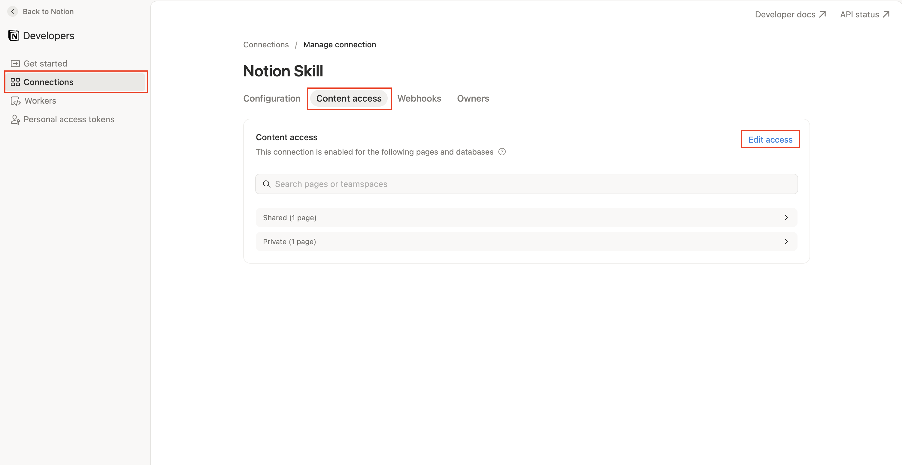
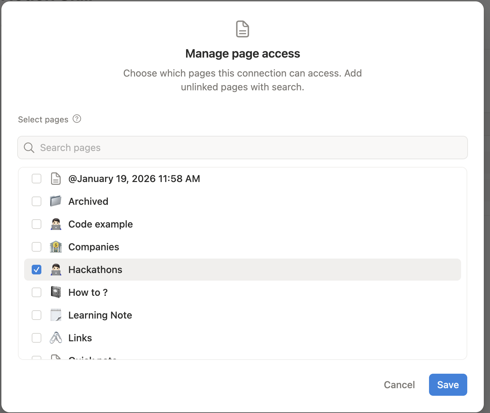

# notion - Setup Guide

Step-by-step setup for the `notion` skill. The skill reads and writes Notion
pages, blocks, databases, and data source rows through the Notion REST API using
an **access token** from a Notion connection.

There is one secret involved:

| Secret | Where it comes from | Stored in |
| --- | --- | --- |
| `NOTION_API_KEY` | Notion connection access token | `.env` |

The connection must also be granted access to the pages and databases you want
the skill to read or write.

---

## Prerequisites

- [Bun](https://bun.sh) installed (`bun --version`).
- You are logged into Notion in your browser as the target workspace user.
- You can create or manage a Notion connection for the workspace.

---

## Step 1 - Create a Notion connection

Open the Notion integrations page:

```txt
https://www.notion.so/profile/integrations
```

This opens the Notion Developers portal. In the left sidebar, select
**Connections**, then click **New connection**.



In the **New connection** dialog:

- **Connection name** - use a clear name, such as `Notion Skill`.
- **Authentication method** - choose **Access token**.
- **Installable in** - choose the target workspace.

Click **Create connection**.



---

## Step 2 - Enable capabilities

Open the connection's settings and check its capabilities.

For read-only use, enable:

- Read content
- Read user information, if user lookup is needed

For writing, also enable:

- Update content
- Insert content

Use the narrowest capability set that matches the work you want the agent to do.
If you later add write capability, re-check the connection settings before using
write commands.



---

## Step 3 - Copy the access token

In the connection settings, find **Integration token**, then copy the
**Access token**. It usually starts with `ntn_` or `secret_`.



Create the skill `.env` from the example:

**Claude Code**
```sh
cp .claude/skills/notion/.env.example .claude/skills/notion/.env
chmod 600 .claude/skills/notion/.env
```

**Codex**
```sh
cp .agents/skills/notion/.env.example .agents/skills/notion/.env
chmod 600 .agents/skills/notion/.env
```

Paste the token:

```dotenv
NOTION_API_KEY=ntn_your_token_here
NOTION_VERSION=2026-03-11
```

Do not paste the token into chat, commit it, or include it in screenshots.

---

## Step 4 - Share pages and databases with the connection

A new Notion connection has no page access by default. Grant access from the
Notion page menu or from the Developer Portal.

### Option A - From the Notion page

Use this when you are already looking at the page or database you want the skill
to access.

1. Open the page or original database the skill should access.
2. Click the `...` menu in the top-right corner.
3. Open **Connections**.
4. Select your connection.
5. Confirm by clicking **Add to page**.





The connection gets access to that page and its child pages.

### Option B - From the Developer Portal

Use this when you want to manage all shared pages for the connection in one
place.

1. Open the connection.
2. Open **Content access**.
3. Click **Edit access**.
4. Select the pages and databases to share.
5. Click **Save**.





Share the original database, not only a linked database view. If the API returns
404 for content that exists, missing connection access is the first thing to
check.

---

## Step 5 - Verify

From the repo root:

**Claude Code**
```sh
bun .claude/skills/notion/scripts/notion.ts status
bun .claude/skills/notion/scripts/notion.ts search --limit 10
```

**Codex**
```sh
bun .agents/skills/notion/scripts/notion.ts status
bun .agents/skills/notion/scripts/notion.ts search --limit 10
```

Expected result:

- `status` shows `configured: true` and bot/workspace information.
- `search` returns pages or data sources shared with the connection.

---

## Step 6 - Read Notion content

Search by title:

```sh
bun .agents/skills/notion/scripts/notion.ts search --query "meeting notes" --type page --limit 10
```

Read page metadata:

```sh
bun .agents/skills/notion/scripts/notion.ts page --id PAGE_ID
```

Read page body blocks:

```sh
bun .agents/skills/notion/scripts/notion.ts blocks --id PAGE_ID --recursive
```

Read a database object and find its data sources:

```sh
bun .agents/skills/notion/scripts/notion.ts database --id DATABASE_ID
```

Query data source rows:

```sh
bun .agents/skills/notion/scripts/notion.ts query-data-source --id DATA_SOURCE_ID --limit 25
```

---

## Step 7 - Write Notion content

Create a child page under an existing page:

```sh
bun .agents/skills/notion/scripts/notion.ts create-page \
  --parent-page PAGE_ID \
  --title "New notes" \
  --text "First paragraph"
```

Append content to an existing page:

```sh
bun .agents/skills/notion/scripts/notion.ts append \
  --id PAGE_ID \
  --text "Added paragraph"
```

Create a row/page under a data source:

```sh
bun .agents/skills/notion/scripts/notion.ts create-page \
  --data-source DATA_SOURCE_ID \
  --properties '{"Name":{"title":[{"text":{"content":"New task"}}]}}' \
  --text "Details"
```

Update page properties:

```sh
bun .agents/skills/notion/scripts/notion.ts update-page \
  --id PAGE_ID \
  --properties ./properties.json
```

Confirm before destructive writes such as:

```sh
bun .agents/skills/notion/scripts/notion.ts update-page --id PAGE_ID --archive true
bun .agents/skills/notion/scripts/notion.ts update-page --id PAGE_ID --trash true
```

---

## Resulting `.env`

**Claude Code**
```dotenv
# Notion access token from https://www.notion.so/profile/integrations
NOTION_API_KEY=<your_token>

# Optional. Defaults shown.
NOTION_VERSION=2026-03-11
```

**Codex**
```dotenv
# Notion access token from https://www.notion.so/profile/integrations
NOTION_API_KEY=<your_token>

# Optional. Defaults shown.
NOTION_VERSION=2026-03-11
```

---

## Troubleshooting

| Symptom | Fix |
| --- | --- |
| `Missing NOTION_API_KEY` | Add the Notion connection access token to `.env`. |
| `401 unauthorized` | Token is missing, malformed, revoked, or from a different workspace. |
| `403 restricted_resource` | The connection lacks the needed capability, such as read, insert, or update content. |
| `404 object_not_found` for an existing page/database | Share the original page/database with the connection. |
| Search returns nothing | The connection has no content access yet, or the title query is too narrow. |
| Data source query fails | Use a data source ID, not a database ID. Retrieve the database to find `data_sources`. |

---

## Security notes

- `.env` is gitignored. Never commit it.
- Never print the token or raw `.env` content into logs, chat, or screenshots.
- Grant the smallest capability set and narrowest content access that will do
  the job.
- To revoke access, rotate/delete the token in the Notion Developer Portal or
  remove the connection from shared pages/databases.
