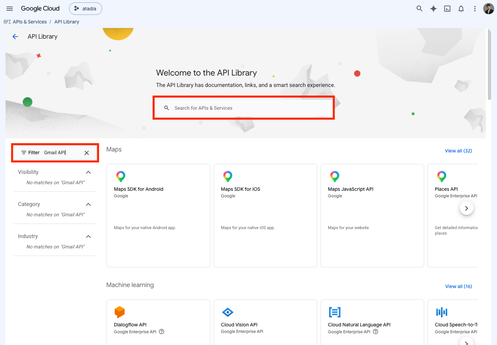
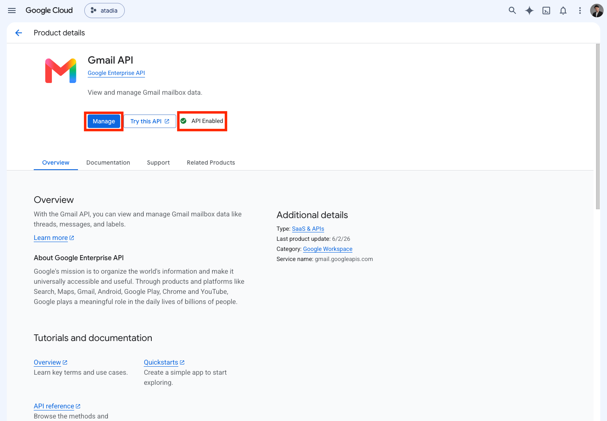
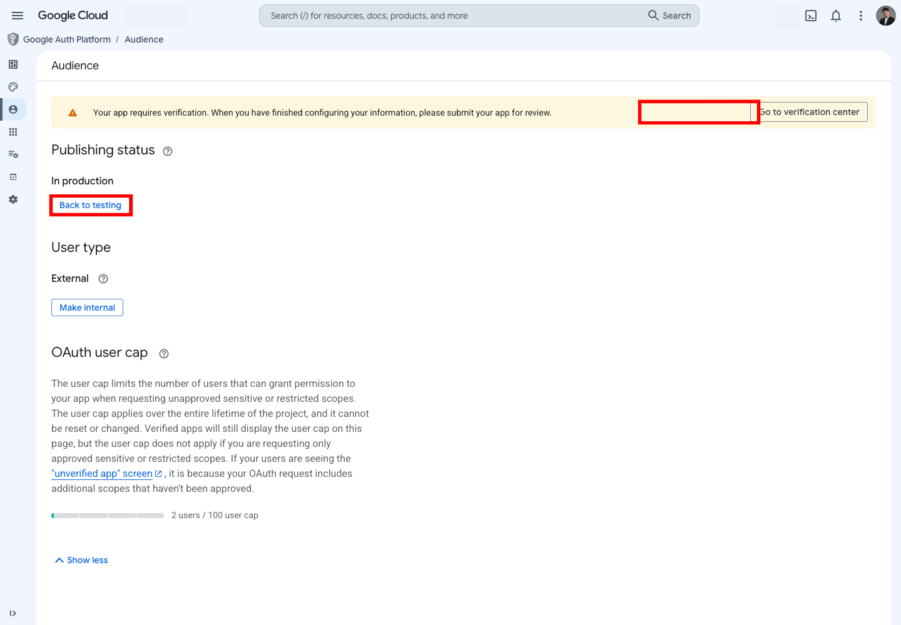
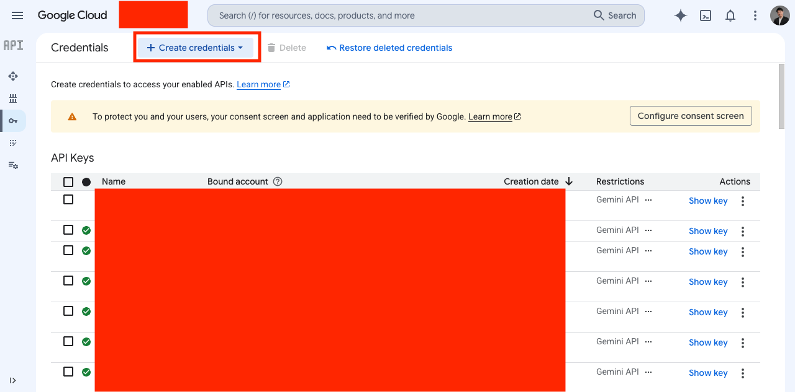
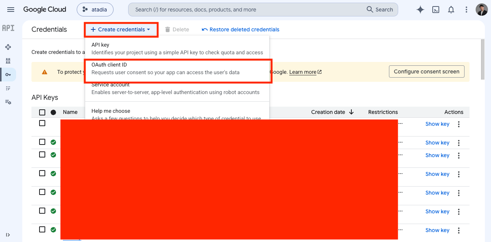
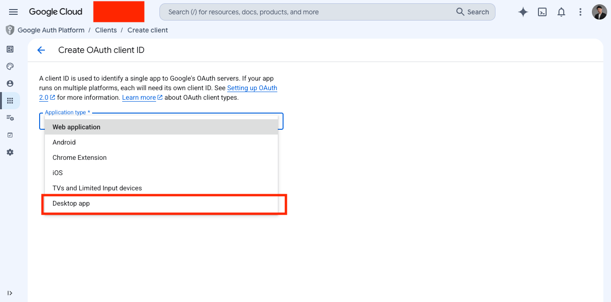
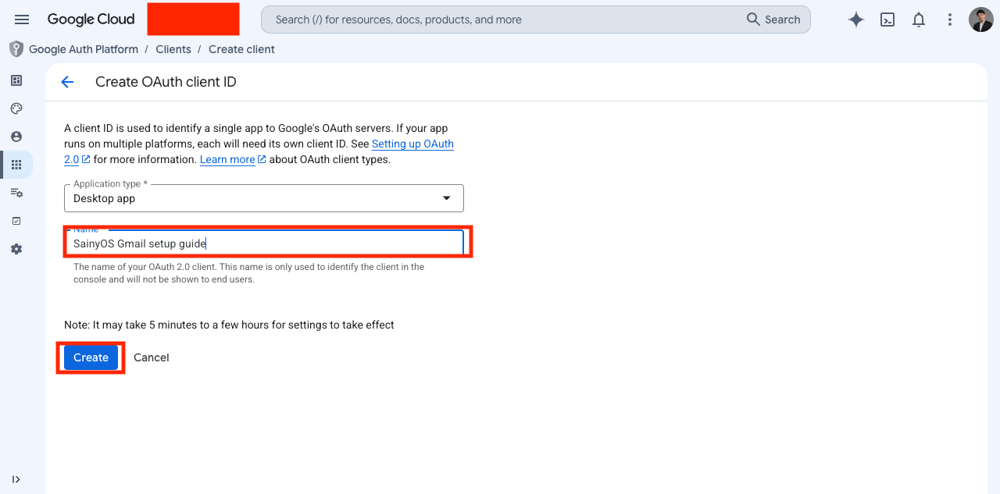
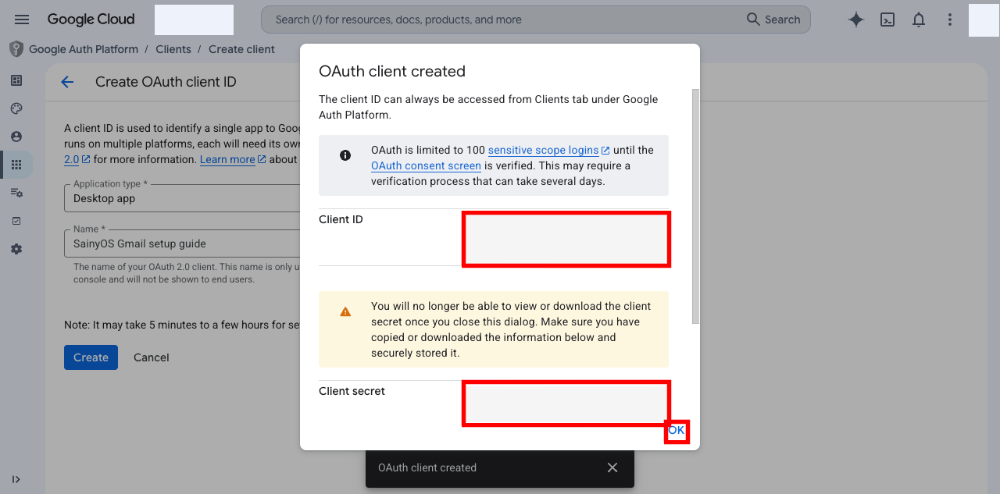

# read-gmail — Setup Guide

How to create and configure a Google OAuth 2.0 client so the skill can read Gmail on behalf of your Google account.

---

## Prerequisites

- A Google account with access to [Google Cloud Console](https://console.cloud.google.com)
- A GCP project (create one at **console.cloud.google.com → Select project → New project** if you don't have one)

---

## Step 1 — Enable the Gmail API

Go to [console.cloud.google.com](https://console.cloud.google.com), select your project, then navigate to **APIs & Services → Library**.



Search for **Gmail API**, click it, and click **Enable**. If the **Manage** button is shown alongside an **API Enabled** badge, it is already on — skip to the next step.



You can also navigate directly (replace `YOUR_PROJECT_ID`):

```
https://console.cloud.google.com/apis/library/gmail.googleapis.com?project=YOUR_PROJECT_ID
```

---

## Step 2 — Configure the OAuth consent screen (first time only)

If this is a brand-new project with no OAuth credentials, GCP requires a consent screen before you can create a client.

Go to **APIs & Services → OAuth consent screen**:

- **User type**: choose **External** (personal Google accounts) or **Internal** (Google Workspace orgs only).
- Fill in **App name** and **User support email**.
- Click **Save and Continue** through the remaining steps — you can skip optional scopes at this stage.

**External apps in Testing mode** — you must add your own Google account as a test user or the OAuth flow will be blocked. Navigate to **Google Auth Platform → Audience**, click **Back to testing** if status shows "In production", then scroll to **Test users → Add users** and enter your email.



> If the consent screen is already configured (existing project), skip this step.

---

## Step 3 — Create an OAuth 2.0 Client ID

Go to **APIs & Services → Credentials**. Click **+ Create credentials**.



Select **OAuth client ID** from the dropdown.



---

## Step 4 — Select Desktop app

On the **Create OAuth client ID** form, open the **Application type** dropdown and choose **Desktop app**.



Enter a descriptive **Name** (shown only in the console, not to end users) and click **Create**.



---

## Step 5 — Copy your credentials

A dialog appears showing your **Client ID** and **Client secret**.



> **Copy both values before closing this dialog.** The client secret cannot be retrieved again — if lost you must create a new secret (or a new client).
>
> Alternatively click **Download JSON** to save a file containing both values.

- **Client ID** — long string ending in `.apps.googleusercontent.com`
- **Client secret** — short string starting with `GOCSPX-`

---

## Step 6 — Fill in `.env`

Copy `env.example` to `.env` inside the skill directory:

```sh
cp .agents/skills/read-gmail/env.example .agents/skills/read-gmail/.env
```

Edit `.env` and fill in the values you copied:

```dotenv
GMAIL_CLIENT_ID=<paste Client ID here>
GMAIL_CLIENT_SECRET=<paste Client secret here>
GMAIL_REDIRECT_URI=http://localhost:3457/gmail/callback
GMAIL_SCOPES=https://www.googleapis.com/auth/gmail.readonly
```

> **Desktop app** clients automatically accept any `localhost` loopback redirect URI — you do not need to register `http://localhost:3457/gmail/callback` anywhere in the GCP console.

> **Reusing credentials with google-office:** You can paste the same Client ID and Secret into both skills' `.env` files. They use different callback paths (`/gmail/callback` vs `/office/callback`) but a single Desktop app client handles both.

---

## Step 7 — Log in

From the repo root:

```sh
bun .agents/skills/read-gmail/scripts/gmail.ts login
```

A browser window opens the Google OAuth consent screen. Sign in and approve the requested permissions. The token is saved to `.agents/skills/read-gmail/.data/accounts/<email>.json`.

Verify:

```sh
bun .agents/skills/read-gmail/scripts/gmail.ts status
```

---

## Troubleshooting

| Symptom | Fix |
|---------|-----|
| `redirect_uri_mismatch` | You likely chose **Web application** instead of **Desktop app**. Create a new Desktop-type client. |
| "Unverified app" / `access_denied` loop | Add your email under **Google Auth Platform → Audience → Test users**. |
| `invalid_client` | Client ID or secret pasted with extra whitespace. Re-check `.env`. |
| Lost client secret | Go to **Google Auth Platform → Clients**, open the client, scroll to **Client secrets**, and add a new one. Or delete the client and repeat Steps 3–5. |
