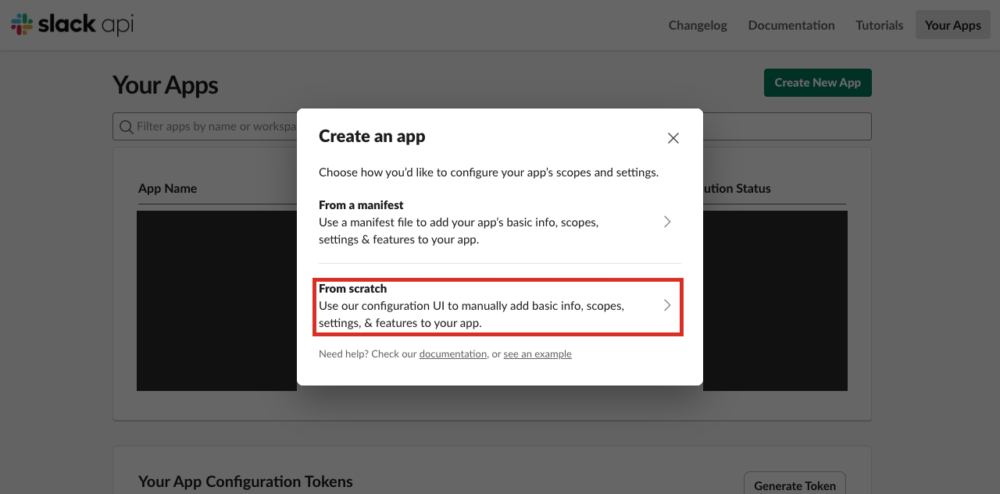
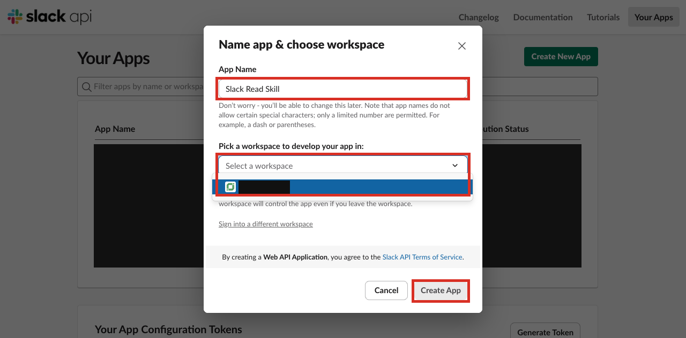
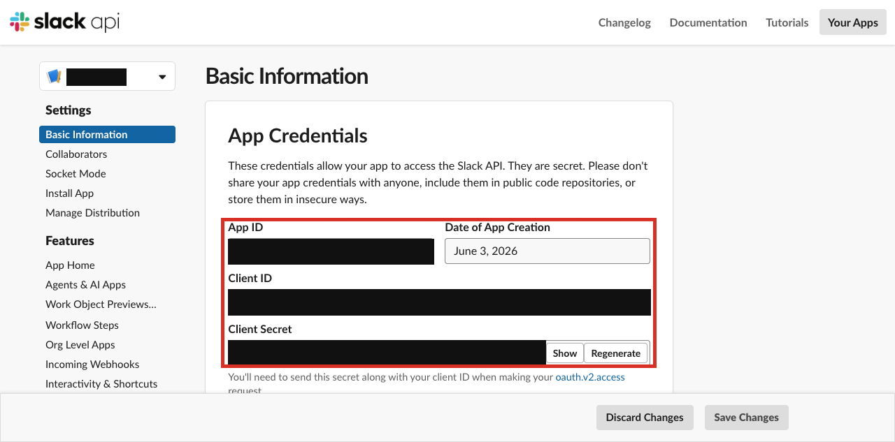
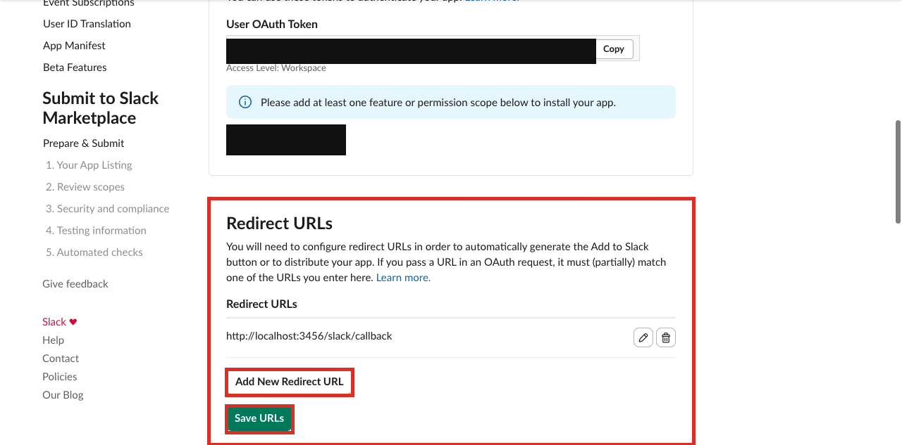
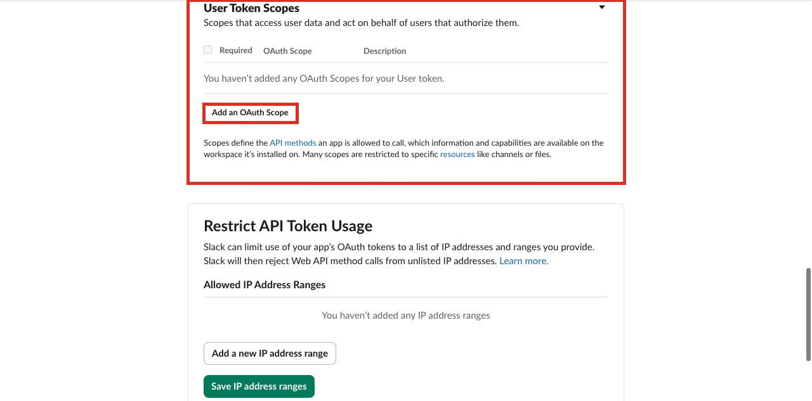
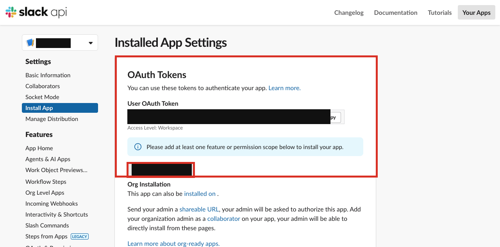

# read-slack-messages — Setup Guide

This guide walks you through creating a Slack app at `api.slack.com` so you can fill in `.env` and run the skill.

---

## Prerequisites

- A Slack workspace where you have permission to install apps.
- [Bun](https://bun.sh) installed locally (`bun --version` to verify).

---

## Step 1 — Create a new Slack app

Go to [api.slack.com/apps](https://api.slack.com/apps) and sign in. Click **Create New App**.

In the **Create an app** dialog, choose **From scratch**.



---

## Step 2 — Name the app and choose a workspace

Fill in:

- **App Name** — any name, e.g. `Slack Read Skill`
- **Pick a workspace** — select the workspace you want to read messages from

Click **Create App**.



---

## Step 3 — Copy your Client ID and Client Secret

After creation you land on the **Basic Information** page. Under **App Credentials**, copy both values:

- **Client ID** — a numeric string like `4175204…`
- **Client Secret** — click **Show** to reveal it

> **Important:** Store the client secret securely. It is shown masked by default and you will need to click **Show** to copy it.



Paste them into the skill's `.env`:

**Claude Code**
```sh
cp .claude/skills/read-slack-messages/.env.example .claude/skills/read-slack-messages/.env
```

**Codex**
```sh
cp .agents/skills/read-slack-messages/.env.example .agents/skills/read-slack-messages/.env
```

```dotenv
SLACK_CLIENT_ID=<paste Client ID here>
SLACK_CLIENT_SECRET=<paste Client Secret here>
SLACK_REDIRECT_URI=http://localhost:3456/slack/callback
SLACK_BOT_SCOPES=
SLACK_USER_SCOPES=channels:read,channels:history,groups:read,groups:history,im:read,im:history,mpim:read,mpim:history,users:read,search:read,files:read
```

---

## Step 4 — Add the redirect URL

In the left sidebar click **OAuth & Permissions**. Scroll down to **Redirect URLs**, click **Add New Redirect URL**, enter:

```
http://localhost:3456/slack/callback
```

Click **Add**, then **Save URLs**.



---

## Step 5 — Add User Token Scopes

Still on **OAuth & Permissions**, scroll down to **Scopes → User Token Scopes**. Click **Add an OAuth Scope** and add each of the following scopes:

| Scope | Purpose |
|-------|---------|
| `channels:read` | List public channels |
| `channels:history` | Read public channel messages |
| `groups:read` | List private channels |
| `groups:history` | Read private channel messages |
| `im:read` | List direct messages |
| `im:history` | Read direct messages |
| `mpim:read` | List group direct messages |
| `mpim:history` | Read group direct messages |
| `users:read` | Resolve user names |
| `search:read` | Full-text search |
| `files:read` | Access shared files |



> **Bot Token Scopes** — leave empty. This skill uses a user token only; no bot token is needed.

---

## Step 6 — Install the app to your workspace

Scroll up on **OAuth & Permissions** (or click **Install App** in the sidebar). Click **Install to \<workspace\>** and approve the OAuth consent screen. If the app is already installed, Slack shows this as **Reinstall to \<workspace\>**.



---

## Step 7 — Log in

From the repo root, run:

**Claude Code**
```sh
bun .claude/skills/read-slack-messages/scripts/slack.ts login
```

**Codex**
```sh
bun .agents/skills/read-slack-messages/scripts/slack.ts login
```

A browser window opens, redirects through Slack OAuth, and lands on `localhost:3456/slack/callback`. The token is saved to `.claude/skills/read-slack-messages/.data/slack-token.json` (Claude Code) or `.agents/skills/read-slack-messages/.data/slack-token.json` (Codex).

Verify with:

**Claude Code**
```sh
bun .claude/skills/read-slack-messages/scripts/slack.ts status
```

**Codex**
```sh
bun .agents/skills/read-slack-messages/scripts/slack.ts status
```

---

## Troubleshooting

| Symptom | Fix |
|---------|-----|
| `invalid_redirect_uri` | The redirect URI in `.env` must exactly match what you entered in Step 4: `http://localhost:3456/slack/callback`. |
| `missing_scope` when reading a channel | The required scope (e.g. `channels:history`) was not added. Go back to Step 5 and add it, then re-run `login`. |
| `not_authed` / token expired | Run `bun … slack.ts login` again to refresh the token. |
| Can't see a private channel | You must be a member of the channel. The token reflects what the authenticated user can access. |
| Lost client secret | Go to **Basic Information → App Credentials**, click **Regenerate** next to Client Secret, then update `.env` and re-run `login`. |
